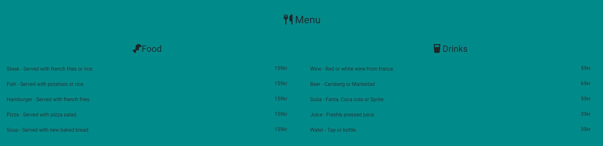
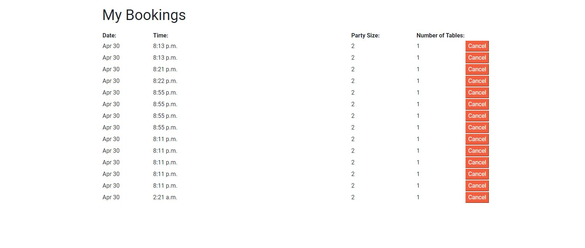
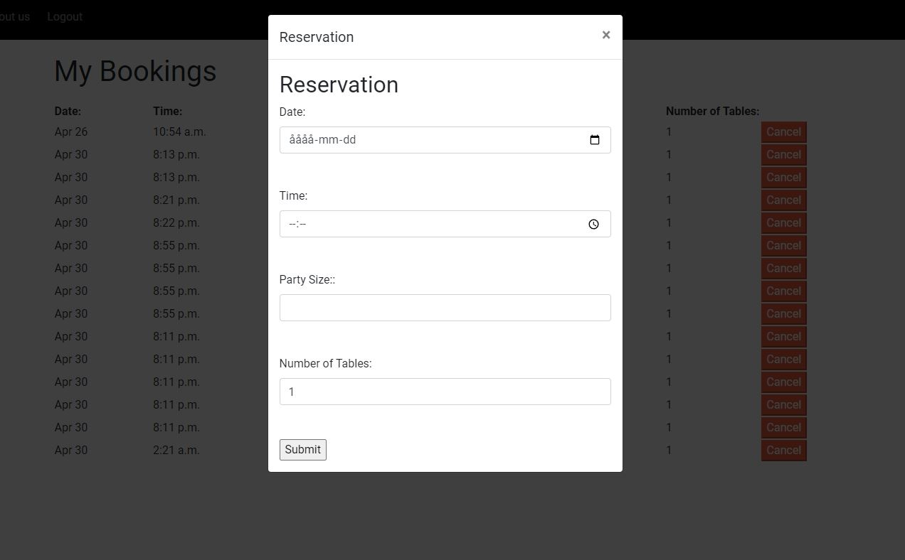

# Joy of Food

This is a Python and Django application for a newly started restaurang, here you can view the menu and there after book a table.

When a user visits the website users can register an account so that they can keep track of their bookings.

[Here is the live version](https://joy-of-food-f30aafe0b05b.herokuapp.com/)

# UX (User Experience)

## Target Audience

The targeted audience for this application are people who love food. People who are seeking to enjoy a good tasting meal. This website is easy to navigate and easy to book a reservation for you and your family.

## User Stories

There are two user who can access this application, the users and the site owner. The site owner can utilise all the futures for booking and cancelling a reservation. Site owen also have the tools to remove or add other users.

As a user you have access to making a reservation, accessing you reservation so that you can se the date and time if needed. You can also delete a reservation if needed.

### User Stories were 

* As a User I can create an account so that my details are remembered.
* As a User I can book one or more guest for a meal in a restaurant so that we have a reservation without any double booking.
* As a User I can cancel my booking so that if i get sick or have to reschedule.
* As a User I can book multiple table so that our team can eat
* As a User I can view the menu of the restaurant so that i know ahead what to order.

### User Stories that i didnt not implement

* As a User I can review the restaurant with a star system so that more people can experience the food.

## Wireframes

The following images shows wireframe of the primary design of the application. These wireframes were created using [Balsamiq Wireframe](https://balsamiq.com/)

### Wireframe of Home Page

This wireframe shows the main page, which is also the base wireframe for the other pages. This is the same if the user is logged in or not. Its give a good feel of the general layout of the page.

### Agile Methodology

I used the Kanban board feature in github project repo ti layout the user stories required for this application. As I completed each user story I moved them across the banban board in stages, from "To do" to in progress and finally "done".

### System Design

The system design i choose to go with in this application was, A collect the dates, time, party size and table numbers. B store that data and C retrieve that data. 

### Data Relationships

The relationship between data models in this application are as followed:

* Account
* Make reservation

### Application features

#### Account

Login - User will find a log in link in the navigationbar that will take the user to a login page. This is a standard login page displaying a from with username and password.
Signup - This page is for new users. It allows the user to enter the necessary details and displays a prompt if any of the form fields are left empty on submitting.

#### Base Template 

There are two common areas in all viewports throughout the application, the header and the foother. They are coded into a "base.html" template in the django framework and thus appear commonly across the site.

##### Header

This is the main header for the application. To the left you will see the site name which is also the name of the restuarant. There after you will find home, about us, register and login. This will change to home, bookings, about us and sign out when logged in. The navigationbars responsiveness to different screen sizes is provided by Bootstraps media queries. To the right user will find a text stating "Make a reservation" followed by a red button stating "Book". This is a simple and fast way for user to make a reservation.

##### Footer

The design is similar to the header with the dark background and red color for important features. In the footer you will find different images of different social media platforms which works as links. 

##### Home page

###### Hero Image

The first section fo the home page is a hero/banner image, it designed for effectiv visual attraction to the site. The background image is of a table with different food types which is a great representation of the restuarant. Users are greated with a jumbotron provided by Bootstrap informing users of the restaurant.

###### Menu 

Second section of the home page is the menu that the restuarant serves. There is a food and drink section where different item is presented and to the right of the items the price is shown.

##### Bookings

When user is logged in, users will gain access to the bookings page. This page shows all the bookings made by a user. It shows date, time, party size and number of tables.
Users have the capability to cancel an booking if needed by pressing cancel button next to the booking the wish to cancel.

##### Book 

Users can make reservations by clicking the book button to the right in the navigationbar or by clicking on the button in the jumbotron modal will show with a form. Users get to fill out the date, time, party size and number of tables before submitting. A prompt will show if any of the form field are left empty. If everything goes well users will be redirected to a page stating that there reservation was successful.

This message show when a reservation is made successfully

This message show when a double booking is made. 

##### About us page

This page is a short informativ page about the owners and the goal for the rasturant.

  

### Features left to Implement

*  A Review section on the home page. This will show reviews made by users via their booking.
*  Select from the menu and add it to you booking. Allows users to add there orders to their booking in advance.

## Technologies Used

The following is a list of the various technologies employed to build this project.

* HTML5 - Hypertext markup language used to give the website its overall structure and semantic value.
* CSS3 - Cascading Style Sheets used to apply consistent styles across all sections of the application.
* Bootstrap5 - CSS framework to assist in rapid site development. Augmented by some custom CSS also.
* Git/Gitpod - Gitpod used as development platform to build incremental versions of the application and Git commands to backup these changes to Github.
* Heroku - Heroku platform used for hosting the deployed application.
* PostgreSQL - This was used as the database storage for the application, it was added as a Resource in the Heroku hosting platform settings.
* Django - Python based web application framework used to build the application.
* Font Awesome - Fontawesome toolkit imported into HTML files and its icons used to show button icons and logo.
* Balsamiq Wireframes - Downloadable software to create the wireframe mockups.

## Testing 

I have manually tested this project by doing the following:

* I tested playing this website in different browsers; Chrome, Firefox, Safari.
* I confirmed that new users can register and log in.
* I confirmed that the header, content in the home page and the about page are readble and all the links are clickable.
* I confirmed that the colors and font chosen are easy to read and accessible by running it through ligthouse in devtools.

## Bugs

Solved bugs

* When double booked a message was printed but it keept looping. The message was wrapped in a for loop, i removed the for loop and it works.

* When deployed to heroku i keept getting the error below. I didnt have a Procfile with the web: gunicorn food_joy.wsgi. When i created one it work fine.

## Remaining Bugs

*  No bugs remaining 

 ## Deployment 

 This project was deployed in heroku and Github.

 * Steps for deployment:
   * Create a new Heroku app
   * Link the Heroku app to the repository.
   * Click on Deplo
 * Deployed on Github

  The live link to this page - [Joy Of Food](https://joy-of-food-f30aafe0b05b.herokuapp.com/)

## Credits

* Shopify for the pictures [Shopify](https://www.shopify.com/)
* Code institute for the basice setup of the idea 

